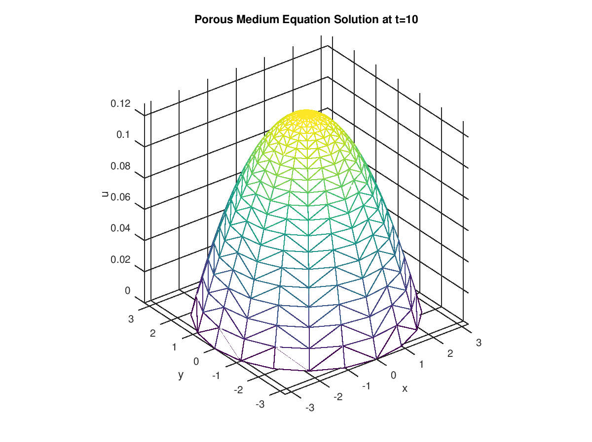

# 2dpme
[](https://travis-ci.org/bvwells/2dpme)

Two dimensional Porous Medium Equation (PME) solved with a moving mesh approach
described in the PhD thesis

*A moving mesh finite element method for the numerical solution of partial differential equations and systems.*

which can be found [here][1].

The Porous Medium Equation is described by the non-linear partial differential equation

```
u_t = ∇.(u^m ∇u)
```

and admits radial self-similar solutions of the form

```
u(r,t) = (1/lambda^d)*(1-(r/(r0*lambda))^2)^(1/m)
```

where

```
r0^d = Q*gamma(1/m + 1/d + 1)/(gamma(d/2)*gamma(1/m + 1))
t0 = ((r0^2)*m)/(2*(d*m+2))
lambda = (t/t0)^(1/(d*m+2))
```

Here ```Q``` is the total mass of the solution ```gamma``` is the gamma function and ```d``` is the dimension of the problem.

## Numerical Solution

The two-dimensional Porous Medium Equation is solved using a moving mesh 
method which uses the monitor function ```M=u(x,t)``` in the moving mesh 
equations for the mesh velocity. The mesh is advanced forwards in time 
using a forward Euler time-stepping scheme. The solution to the PME 
is obtained as a reconstruction step by considering conservation of
the monitor function. All the moving mesh equations are solved using
linear finite elements.

## Building and Developing

Developing locally requires Docker for Windows. Run the command

```
docker build -t 2dpme .
```

to build the docker image which pulls the gcc base image containing gfortran and maps the source code into the container.

Then run image with the command:

```
docker run -i -t -v /f/git/src/github.com/bvwells/2dpme:/app 2dpme
```

This command maps the local workspace into the running image so any changes made in the running image will be reflected on the local workspace.

Within the running image generate the make files for the release version by running the command:

```
cmake .
```

To build the debug version of the code run the command:

```
cmake -DCMAKE_BUILD_TYPE=Debug
```

Build the executable by running the command:

```
make
```

## Running

The program takes the file [variables.data](./variables.data) as input to the simulation. The program can be run from the base of the repo with the command:

```
./bin/2dpme.exe
```

The program outputs the mesh and solution over time into the files ```cells.m``` and ```solutionXXX.m,``` respectively. The variables for the solution are written to the file ```variables.m```.

## Plotting Solution

The output from the simulation can be plotted in [Octave](https://www.gnu.org/software/octave/) by running the plotting file
[plot_solution.m](./plot_solution.m) in the root of the repo.



[1]: http://www.reading.ac.uk/nmsruntime/saveasdialog.aspx?lID=24080&sID=90294
